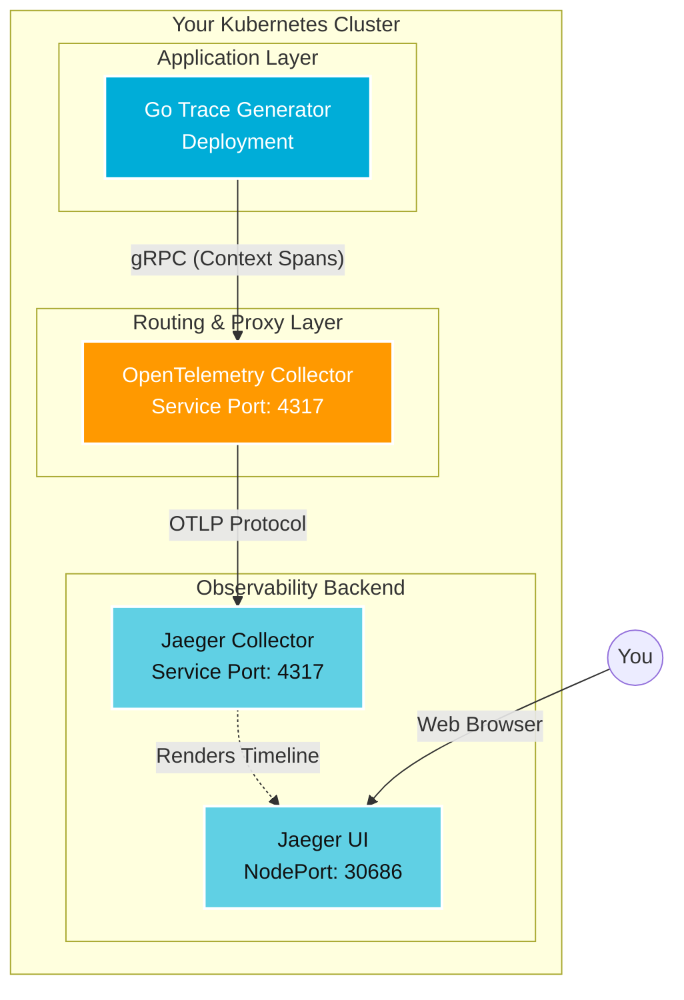

#  Cloud-Native Distributed Tracing Pipeline: Kubernetes + OpenTelemetry + Jaeger 

Welcome to the central documentation for the distributed observability stack. This README outlines the architecture, data flow, technical milestones, and post-mortem debugging logs for a production-grade tracing pipeline built from the ground up.

This repository demonstrates a deep, practical understanding of modern cloud-native infrastructure, microservices latency tracking, and telemetry routing within a Kubernetes environment.

---

## 🏗️ Architecture Overview

The pipeline consists of three core components working in tandem inside the Kubernetes cluster to generate, route, and visualize telemetry data in real-time.

### Core Components

* **The Generator (`main.go` & `go-app-deployment.yaml`):** A custom Go application running on a continuous loop inside a Deployment. It generates structured parent and child trace spans (simulating database queries and API calls) and pushes them over the network via gRPC.
* **The Router (`otel-collector.yaml`):** The OpenTelemetry data proxy (comprising a ConfigMap, Deployment, and Service). It catches the incoming traces from the Go app on port `4317`, batches them for performance, and forwards them using the standard OTLP protocol.
* **The Backend (`jaegar-deployment.yaml`):** The storage and visualization layer. It receives the OTLP traces from the collector on port `4317` and displays them in a graphical timeline UI accessible via your browser using a NodePort (`30686`).

---

## 🏆 Key Technical Milestones

This architecture goes beyond standard deployments, wiring up a modern observability stack from absolute scratch.

* **Mastered Distributed Context Propagation:** Transitioned from flat logging to true distributed tracing. The Go application captures a parent context (`transaction-root-process`) and passes it down into child functions (simulated DB and API calls), mirroring the exact pattern used in enterprise microservices to track system-wide latency.
* **Provisioned an OpenTelemetry Gateway:** Successfully deployed the industry-standard OpenTelemetry Collector. Configured its internal pipeline (Receivers → Processors → Exporters) and successfully mapped its storage volumes via Kubernetes `ConfigMaps`.
* **Modernized Protocol Standards:** Migrated infrastructure configurations away from deprecated tech, successfully implementing the modern **OTLP (OpenTelemetry Protocol)** standard for cross-service communication.
* **Navigated Kubernetes Networking:** Diagnosed and resolved internal DNS lookup failures, bridging the gap between external Docker networking constraints and internal Kubernetes `ClusterIP` CoreDNS resolution.
* **Executed a Full Deployment Lifecycle:** Built custom container images, managed public registry distribution (Docker Hub), and orchestrated them alongside third-party backend services.

---

## 🪲 Post-Mortem & Debugging Log

A critical component of infrastructure engineering is resolving bottlenecks. Below is the incident log detailing the errors encountered during the build phase, their root causes, and the architectural fixes applied.

### ❌ Error 1: Network DNS Failure

* **The Error:** `dial tcp: lookup opentelemetry-collector.default.svc.cluster.local on 8.8.8.8:53: no such host`
* **The Root Cause:** The Go application crashed because it couldn't resolve the DNS name of the telemetry collector. This occurred initially because Docker was running locally on the host machine (relying on standard internet DNS) and had no visibility into Kubernetes' internal routing fabric.
* **The Resolution:** Published the Docker image to a public registry and deployed it natively *inside* the cluster to utilize internal CoreDNS. Verified the `opentelemetry-collector` service was active to receive the traffic.

### ❌ Error 2: Missing Volume Declaration

* **The Error:** `The Deployment "opentelemetry-collector" is invalid... Not found: "config-volume"`
* **The Root Cause:** In the collector's deployment manifest, the container was instructed to mount a file system volume named `config-volume` to read its configuration file. Kubernetes rejected it because the volume source was not declared at the bottom of the pod template.
* **The Resolution:** Appended the `volumes:` array block at the end of the deployment spec, explicitly linking the arbitrary name `config-volume` to the actual `otel-collector-config` ConfigMap resource.

### ❌ Error 3: Deprecated Exporter Type

* **The Error:** `unknown type: "jaeger" for id: "jaeger" (valid values: [otlp, prometheus, zipkin...])`
* **The Root Cause:** The OpenTelemetry project recently modernized its pipeline and completely removed the old, custom "jaeger" data exporter from the collector binary. The collector crashed upon startup because it couldn't unmarshal `type: jaeger`.
* **The Resolution:** Rewrote the ConfigMap to utilize the modern, industry-standard `otlp` exporter. Updated the Jaeger deployment to ensure it was listening for standard incoming OTLP traffic on port `4317`.

### ❌ Error 4: Invalid TLS Configuration Syntax

* **The Error:** `error reading configuration for "otlp"... '' has invalid keys: insecure`
* **The Root Cause:** When transitioning to the new `otlp` exporter format, the `insecure: true` flag was placed directly under the endpoint. The `otlp` schema strictly requires security settings to be nested inside a dedicated `tls` block.
* **The Resolution:** Re-indented the ConfigMap to place `insecure: true` as a child of a `tls:` block. Forcefully deleted the old ConfigMap and the crashing collector pod to trigger a restart and mount the newly validated configuration structure.
